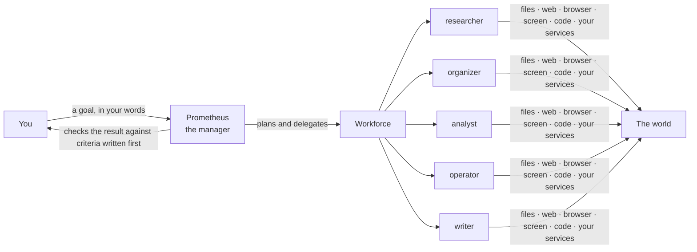

<p align="center">
  
</p>

<h1 align="center">Prometheus</h1>

<p align="center">
  <a href="https://github.com/AethraIntelligence/Prometheus/actions/workflows/ci.yml"></a>
  
  
  
  <a href="LICENSE"></a>
</p>

**Tell it what you want done. An AI manager plans the work, hands it to a team of
digital employees, checks the result, and does it all on your own machine.**



Prometheus is a local-first platform: no server to rent, no account to create, no
data leaving your computer unless you point it at a hosted model. It chats like an
assistant when you ask a question, and works like a team when you ask for work.

---

## In short

| | |
|---|---|
| **It does real work, not just answers** | Reads and sorts your files, searches the web and reads pages, analyses data by running code, writes documents and PDFs, answers from documents you gave it, and operates interfaces that have no API. |
| **You can trust what it reports** | Success criteria are written *before* the work starts, and results are checked against what actually happened on your machine, not against what the model says it did. |
| **You stay in control** | Anything irreversible waits for your approval. Employees get only the tools they are declared for. One command stops everything. Every action, including refused ones, is audited. |
| **It is yours to run and extend** | Runs fully offline on local models through Ollama. A new employee, workflow or connected service is a file, not code. |

---

## Quick start

**You need:** Python 3.12+, [uv](https://docs.astral.sh/uv/), Node 20+, the Rust
toolchain, and either [Ollama](https://ollama.com) (free, local) or a provider key.

Running generated Python additionally needs Docker and one explicit install:

```bash
docker pull python:3.12-alpine
```

Without it, the rest of Prometheus works and `code.run` reports itself unavailable.

```bash
git clone https://github.com/AethraIntelligence/Prometheus.git && cd Prometheus
./start.sh
```

`start.sh` installs everything with one `uv sync` (no extras to remember), creates
the database, and opens the desktop window. The window starts the runtime, the
runtime starts Ollama if your catalog uses local models, and the browser engine is
downloaded on first start.

Then type a goal:

> *What is the capital of France?* - answered on the spot.
> *What is the weather in Milan right now?* - looked up on the web.
> *How much does express delivery cost?* - quoted from the policy you added.
> *Read my meeting notes and write decisions.md, one line per person.* - planned, delegated, checked.
> *Find this week's AI news and make me a PDF with sources.* - researched, written, shown beside the answer.

<details>
<summary>Prefer the terminal?</summary>

```bash
uv sync
uv run alembic upgrade head                 # creates ~/.prometheus/prometheus.db
cp .env.example .env                        # add a provider key, or use Ollama below
uv run prometheus ask-prometheus "Summarise every file in notes/ into summary.md"
uv run prometheus serve                     # the same runtime as a local web page
```

Free and offline:

```bash
ollama pull gpt-oss:20b && ollama pull bge-m3
export PROMETHEUS_MODEL_CATALOG_PATH=infrastructure/llm/models.local.toml
```

</details>

---

## What it can do

### Ask, delegate, or schedule

Use **Ask** for conversation, web and document questions, and **New task** when
you are delegating an outcome. Both use the same manager and workspace knowledge:
a greeting or stable fact can still be answered directly, while anything that
has to be looked up, touches your files or must exist afterwards becomes work -
a plan, the right employees and a check before you see the result. **Scheduled**
keeps standing instructions and shows every firing as its own run.

### A team of five, each declared in one file

Each employee is a directory under [`employees/`](employees).

| Employee | Does | Reaches the world through |
|---|---|---|
| `researcher` | Finds out what is true and says where it came from | web search, browser, files |
| `organizer` | Puts a folder in order and says what it moved | files |
| `analyst` | Computes answers from data on this machine | files, code it runs under limits |
| `operator` | Works interfaces with no API - a canvas, an embedded viewer | browser, then the screen |
| `writer` | Turns findings into the document that was asked for | files, PDF |

Work is routed by what each employee declares it can do. Nothing in the manager
names an employee, so adding a sixth is adding a directory. The **Workforce**
screen shows whether each role is ready on this machine, its hand-off contract,
permissions, model requirements and recent assignments. Selection reasons and
rejected alternatives are stored with each assignment; performance figures are
scoped to a workspace and time window and show their sample size or explain why
there is not enough data.

### Leaves its files where you can find them

Every task works in a folder of its own, `~/Documents/Prometheus/<task name>`, made
on the first request. The **+** under the field points a task at another folder -
one you saved in **Settings -> Workspaces** or any folder picked from the system
dialog - and a small bar under the field then says which. Answers render as
Markdown, with sources as links named after the publication. The files a task
wrote appear under its answer and open in a preview beside the conversation: PDF,
images, Markdown and text. A PDF is written from Markdown by the local browser
engine, so any alphabet prints.

### Explains a run without exposing its contents

The desktop **Observability** view follows one run from request through plans,
employees, model routing, tools and approvals to its result. It marks the first
causal failure and the recovery that followed, while keeping prompts, responses,
files, screenshots and raw tool payloads out of the trace. Health, scoped SLO
metrics, explicit diagnostic export and `prometheus audit --verify` use the same
application boundary. See [Observability and diagnostics](docs/observability.md).

### Knows your documents

Add PDF, Word (`.docx`), Markdown, HTML, CSV, JSON or plain text from the system
file picker. Answers quote the document they came from. Search is hybrid - by
meaning and by words - with a multilingual embedding model (`bge-m3`), so a question
in Russian finds a policy written in English. A newer version of a file replaces
the old one in place; changing the embedding model re-indexes by itself.

### Remembers, within limits you can see

What a task learned, what a plan produced and how you like things done are
recalled into the next run, so *"do the same for the returns folder"* means
something. The nearest eight answered turns are also kept as exact, thread-local
context; older durable facts come from memory instead of an ever-growing prompt.
Working notes expire in hours, outcomes fade over months, stated
preferences stay until you change them. Documents are kept apart from memory:
they do not decay, and they are cited.

### Separates contexts

Workspaces keep work and personal apart: each has its own files, documents and
history. Its files live under one root, chosen with the system folder dialog, and
each task gets a folder inside it.

### Uses the most direct way in

```
API  ->  integration  ->  browser  ->  screen inside the page  ->  your desktop
```

Every tool declares which rung it is on, and the choice is logged. Screen control
follows *look, act, check*: a vision model finds the target, every click can be
confirmed by looking again, and a target outside the frame is refused, not guessed.

### Connects to your services

Any [MCP](https://modelcontextprotocol.io) server added in **Settings -> Plugins**
becomes ordinary tools. What each capability does to the world is classified on
your machine, never by the server; anything unclassified is treated as dangerous
and asks first; nobody can use a service until you grant it.

### Runs known processes, and starts work on its own

A process you already know the shape of is a YAML file under [`workflows/`](workflows). A
schedule ("every morning", "every 3 hours") or an event can start an objective with
nobody at the keyboard - through the same checks and the same brake. Work nobody
asked for is opt-in: `PROMETHEUS_FLAGS__SCHEDULER=true`. Daily schedules keep an
IANA time zone, so "09:00" remains 09:00 across daylight-saving changes. A
persistent renewable lease prevents two runtime processes from firing the same
schedule, and each automatic or manual run keeps its status, cost and schedule
version in the run history. Overlapping runs are skipped and missed times
coalesce into one current run rather than creating a catch-up burst.

When the same multi-step structure succeeds at least three times in one
workspace, Workforce may suggest saving it as a workflow. The suggestion keeps
the structural steps and source run IDs, not the request text. Saving requires a
separate confirmation and creates only a manual YAML draft: it does not run,
schedule itself or grant a role new permissions. Suggestions can be snoozed or
dismissed.

Tool execution is crash-safe by default: the `(task, provider call id)` intent
is persisted before an external action. A completed result is replayed after a
restart; a call whose outcome is uncertain is surfaced as uncertain and is not
automatically repeated.

---

## Why you can trust the result

1. **The standard comes first.** Reading your request produces acceptance criteria,
   stored before any work starts, so success cannot be redefined after the fact.
2. **The record outranks the report.** The verifier sees what the platform recorded
   - which tools ran, which files were written - next to what the employees claim.
   An answer describing a file nobody wrote does not pass.
3. **A shortfall is said plainly.** Rejected work is replanned once with what was
   missing; after that you get what did succeed plus a clear list of what did not.
4. **Contradictions are surfaced, not blended.** When two employees disagree, the
   manager settles what the evidence settles and shows you the rest.
5. **Behaviour is measured, not asserted.** `validation/scenarios/` holds real
   requests; `prometheus validate` runs them and `prometheus validation-report`
   computes what works reliably, sometimes, or not at all.

## Why it is safe to let it act

- **Risk follows the effect.** Reading is low, writing medium; sending, spending,
  deleting, publishing and running generated code are high and wait for a person.
  A tool can declare itself riskier than its effect, never safer.
- **Least privilege is a list you can read.** An employee gets exactly the tools it
  lists (`prometheus tools`), and its declared policies (`read_only`, `no_sending`...)
  can only narrow what it may do.
- **The filesystem is fenced.** File tools see one folder per task, symlinks
  resolved; anything outside is refused, not approved. The top of the disk and
  your home folder itself cannot be chosen as a task's folder.
- **Generated code has an OS boundary.** `code.run` uses the same locked-down
  Docker container on every platform, with no network or user/workspace mounts
  and explicit CPU, memory, time, disk and output limits. Without a running
  Docker engine and the sandbox image, it fails closed.
- **The desktop is opt-in per application.** With no allowed applications, nothing
  on your desktop can be touched, and every desktop action asks each time.
- **There is a brake.** `prometheus stop` writes a file every screen action reads
  first - it works from a second terminal while a run holds the screen.
- **Silence is a no.** An unanswered approval expires and is refused. Approvals can
  also reach you on Telegram.
- **Remembered permission is exact and revocable.** An approval can apply once,
  to the same employee/action/resource for this task, or become an expiring
  persistent rule. Settings → Permissions shows and revokes every active rule;
  a declared denial always wins.
- **Everything is audited**, including actions that were refused and never ran.
- **Content is data, not instructions.** A web page, an email or a document is
  quoted to the model inside markers; nothing in it can change a policy or a grant.

---

## Models: local, hosted, or both

Nothing outside `infrastructure/llm/` names a model or a vendor. A caller states what
the work needs - reasoning, tool calling, vision, a long context, embeddings - and
the router picks from the catalog.

- **In the window:** Settings -> Providers and models. Add a connection (Ollama,
  OpenAI, Anthropic, Gemini, OpenRouter), pick installed models from a list - their
  context length is read from the runner - and choose which model does each kind of
  work, including embeddings.
- **In files:** `models.toml` (OpenRouter), `models.anthropic.toml`, and
  `models.local.toml` (Ollama, zero cost).
- **Ollama settings stay in Ollama.** Prometheus starts the Ollama app when it is
  needed and never overrides your context length or other runner options.

Costs and tokens of every call are logged: `prometheus spend`.

---

## Where things are kept

What the work produces goes to `~/Documents/Prometheus`, a folder per task. The
platform's own data is SQLite by default - one file in `~/.prometheus`. PostgreSQL (or Supabase) is a
setting, and moving is *copy -> verify row by row -> erase only when you confirm*:

```bash
uv run prometheus storage-migrate --to postgresql://localhost/prometheus
```

---

## Extending it

| To add | You write | Example |
|---|---|---|
| An employee | `employees/<name>/employee.yaml` | tools it may use, work it can take, limits |
| A workflow | `workflows/<name>.yaml` | named steps, who does each, dependencies |
| A connected service | nothing - Settings -> Plugins | any MCP server by name and command |
| A tool | one file in `infrastructure/tools/` + one line in `builtin.py` | declare parameters and effect; schema and risk follow |
| A model | a catalog entry, or Settings | no code change anywhere |

```yaml
# employees/translator/employee.yaml
name: translator
role: Translator
goals:
  - text: Say what the original says, not what it would have said.
allowed_tools: [fs.read, fs.write]   # may it?  least privilege
capabilities: [FILE_ACCESS]          # can it?  what the manager routes by
model_profile:
  capabilities: [TEXT_REASONING, LONG_CONTEXT]
limits: { max_steps: 8, max_cost_usd: 0.50 }
contract:
  accepts: [FINDINGS]
  produces: [ANSWER, FILE]
  evidence: [ARTIFACT]
```

---

## Architecture

```
app/             transport and composition root: CLI, local HTTP API
application/     the manager, the one employee runtime, memory, knowledge, the interface boundary
domain/          protocols and values - depends on nothing
infrastructure/  adapters: models, storage, tools, browser, MCP
desktop/         Tauri + React window - an adapter over the HTTP API, no business logic
employees/  workflows/  prompts/  validation/scenarios/    declarations and content
```

- **The window** has its own guide: [`desktop/README.md`](desktop/README.md).
- **One boundary for every interface.** The CLI, the web page and the desktop window
  all talk to `application/interface/`; a new surface is an adapter, not a fork.
- **One runtime for every employee.** Employees differ only by declaration.
- **Layering is enforced**, by `import-linter` and by tests that read the source; the
  frontend follows Feature-Sliced Design with its own architecture test.
- **Decisions are written down.** Twenty-eight ADRs in [`docs/adr/`](docs/adr) record
  what was chosen, what was rejected, and the failure that forced the choice.

<details>
<summary>The command line</summary>

```text
ask-prometheus "<goal>"   objectives   serve   stop [--clear]
employees   tools   policies   approvals   approve <id>   reject <id>   audit
run-task --employee <name> "<goal>"   resume   workflows   run-workflow <name>
workspaces   workspace-new   workspace-use   documents   document-add <path>
memory [--search] [--prune]   models   spend   integrations   prompts
schedule "<request>" --every N | --daily-at HH:MM   schedules   events
storage   storage-migrate --to <url> [--erase]   validate   validation-report
```

</details>

---

## Development

```bash
uv run pytest                                  # whole suite: no network, no key
uv run ruff check . && uv run lint-imports
uv run python scripts/check_english_only.py
cd desktop && npm test                         # the window, against a scripted runtime
PROMETHEUS_TEST_POSTGRES_URL=postgresql://localhost/prometheus_test uv run pytest
```

The codebase is English-only - identifiers, comments, logs, schema and docs. What
the agents answer in is configuration: `PROMETHEUS_RESPONSE_LANGUAGE`.

## Contributing and feedback

Found something that does not work, or a request it handled badly? Open an issue at
[github.com/AethraIntelligence/Prometheus/issues](https://github.com/AethraIntelligence/Prometheus/issues) with the request you typed and
what came back - that is exactly what a validation scenario is made from.

## Status

Nineteen phases complete, from a single model call to a verified, multi-employee
workforce with memory, documents, integrations, a desktop window and a second
storage backend - each closed only after doing real work, recorded in
[`validation/tasks/`](validation/tasks). The roadmap is in
`development/implementation-plan.md`.

## License

[MIT](LICENSE) © 2026 Denys Zhodik
